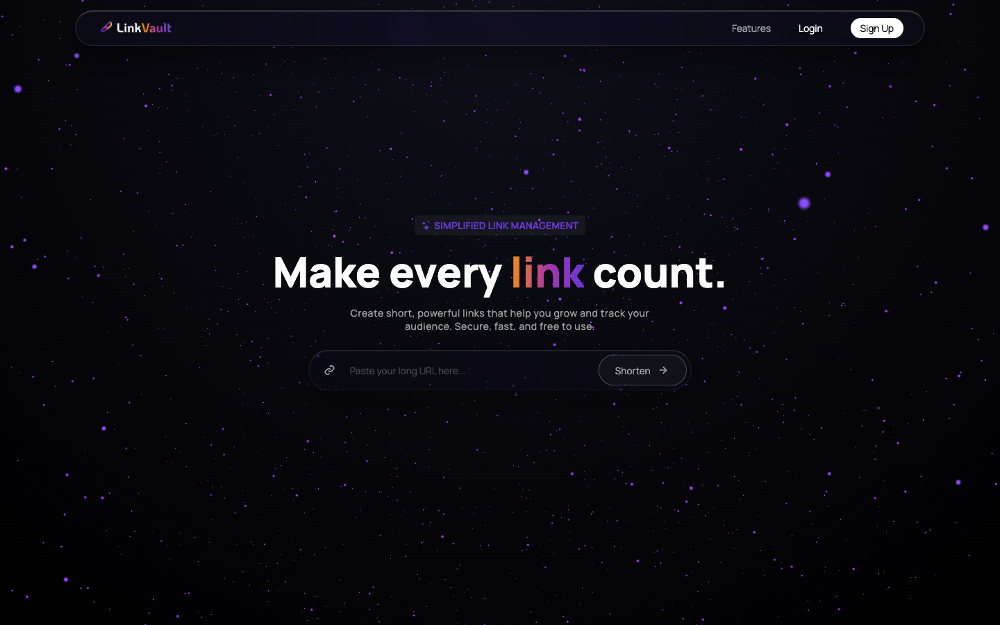
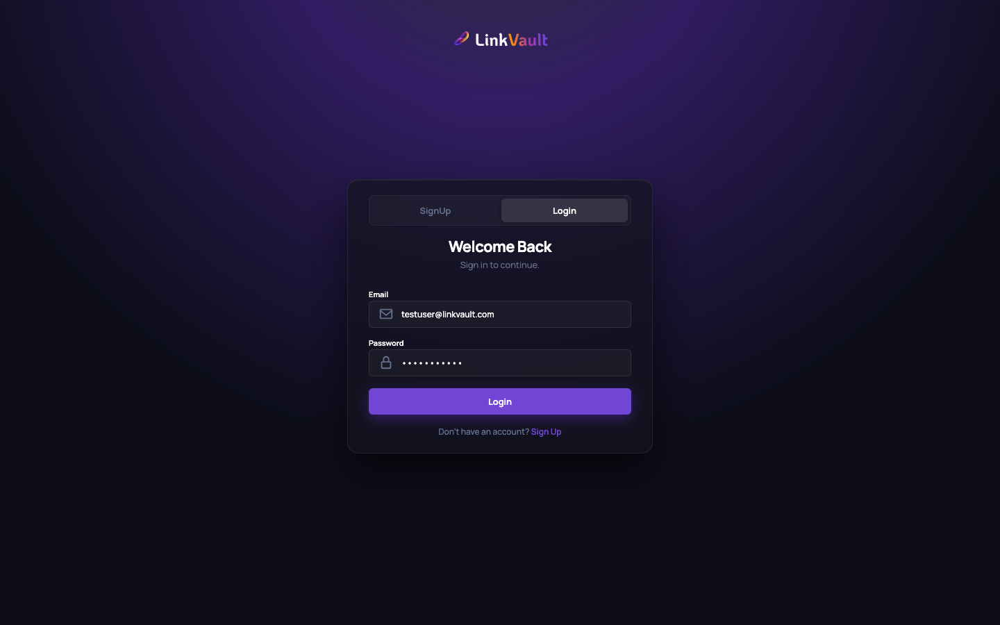
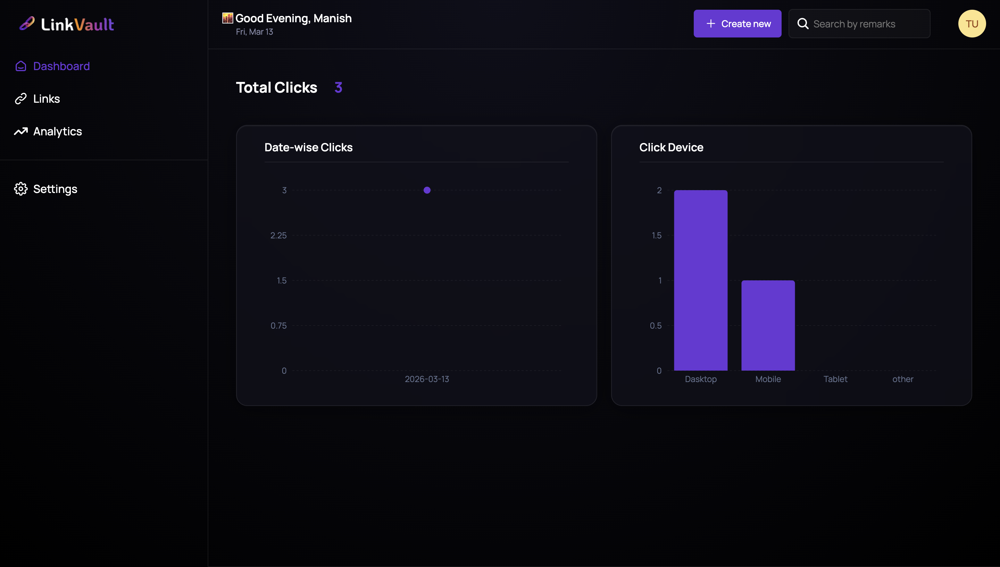

# LinkVault - URL Shortener & Analytics Platform

LinkVault is a full-stack web application designed for creating short URLs, tracking engagement analytics, and managing user profiles. The application features a premium dark glassmorphism user interface.

## 🚀 Project Overview
The project is split into two primary environments: a `Node.js/Express` API backend and a `React/Vite` SPA frontend. 

## 🛠️ Tech Stack Summary
- **Frontend**: React 18, Vite, React Router v7
- **Styling**: Vanilla CSS Modules (Dark Glassmorphism UI)
- **Data Visualization**: Recharts, Three.js (for 3D effects)
- **Backend**: Node.js, Express.js
- **Database**: MongoDB & Mongoose
- **Authentication**: JWT & bcryptjs

## 🏗️ Architecture
LinkVault follows a decoupled client-server architecture:
- **Client (Frontend)**: A Single Page Application (SPA) built with React and Vite. It handles routing locally and communicates with the backend via RESTful API calls using Axios. It emphasizes an interactive and rich UI experience rendered entirely in the browser.
- **Server (Backend)**: An Express.js REST API that serves JSON data. It acts as the intermediary between the frontend and the MongoDB database. It is responsible for business logic, authentication, generating unique short codes (using `nanoid`), parsing User-Agent headers, and aggregating analytic data.
- **Database**: A NoSQL MongoDB database storing user profiles, URL mappings, and extensive click logs for analytics.

---

## 💻 Frontend

The frontend is a React application built with Vite. It heavily focuses on a "Dark Glassmorphism" design aesthetic—utilizing rich backdrop blurs, translucent cards, interactive hover states, and dynamic charts.

### Key Features Addressed:
- **Global Dark Theme**: Built around `tokens.css`, eliminating solid white backgrounds in favor of translucent floating elements (`rgba(18, 18, 28, 0.7)`).
- **Interactive Dashboard**: Upgraded from raw text lists to interactive visual charts (using `recharts`) showing *Date-wise* and *Device-wise* click metrics.
- **Custom Components**: Polished UI elements including a custom CSS loading spinner, glassmorphism Modals (`LinkModal`, `DeleteModal`), and a profile avatar with custom `box-shadow` glow effects.
- **Seamless Navigation**: Fully responsive table and pagination layouts for viewing analytics and individual click logs.

---

## 📸 App Preview

<br/>

<br/>


---

## 🔑 Test User Credentials
If you'd like to test the live dashboard, charts, and link creation without registering your own email, feel free to use the test account credentials provided below:
- **Email**: `testuser@linkvault.com`
- **Password**: `password123`

---

### Packages Used (`frontend/package.json`):
- `react`, `react-dom`, `react-router`: Core library and front-end routing framework.
- `axios`: For robust HTTP requests to the backend API.
- `recharts`: For rendering customized, interactive `LineChart` and `BarChart` components on the Dashboard.
- `framer-motion`: For fluid UI animations and layout transitions.
- `react-icons`: For scalable vector UI iconography.
- `react-toastify`: For toast notifications, heavily styled to match the dark theme.
- `three`: 3D library utilized for the immersive shader background on the Landing Page.

---

## ⚙️ Backend

The backend is built using Node.js, Express, and MongoDB (via Mongoose). It handles authentication, link generation, and compiles deep analytics.

### Key Features Addressed:
- **Secure Authentication**: Uses JWT and bcrypt for strict user authentication and data separation.
- **Short-Code Generation**: Safely generates random, unique URL slugs.
- **Deep Analytics Aggregation**: Stores raw click logs and parses User-Agent headers to determine the device, browser, and OS of the link clicker.

### Packages Used (`backend/package.json`):
- `express`: Core framework for handling API routing.
- `mongoose`: MongoDB object modeling tool.
- `jsonwebtoken`: To securely generate and verify auth tokens.
- `bcryptjs`: To hash and salt passwords before entering the database.
- `nanoid`: Crucial for generating the small, unique, URL-safe short link strings.
- `ua-parser-js`: Extracts readable device types (Mobile, Desktop) and OS data from incoming HTTP requests.
- `cors`, `dotenv`, `validator`: Standard utilities for cross-origin sharing, environments, and string verification.

### Core Controller Functions:

**`authControllers.js`**:
- `register()`, `login()`, `logout()`: Standard auth flow endpoints.
- `getProfile()`, `updateProfile()`: Handles fetching and updating user account details.
- `deleteAccount()`: Safely wipes the user, their links, and their respective click logs from the database.

**`linkControllers.js`**:
- `createLink()`, `getShortLink()`, `updateShortLink()`, `deleteShortLink()`: Standard CRUD operations for the Short Links.
- `getAllLinks()`: Pulls a paginated list of the user's links.
- `getAnalytics()`: Pulls a paginated, raw list of individual click logs.
- `getAnalyticsSummary()`: A critical aggregation grouping all a user's click logs into structured arrays (`dateWise`, `deviceWise`, `totalViews`). This function is what directly feeds the interactive `recharts` on the Frontend Dashboard.

---

## ⚙️ Installation & Setup

To run this project locally, you will need Node.js and npm installed.

### 1. Clone the repository
```bash
git clone https://github.com/your-username/LinkVault.git
cd LinkVault
```

### 2. Backend Setup
```bash
cd backend
npm install
npm run server
```
*The backend server will run on http://localhost:3000 by default (via nodemon).*

### 3. Frontend Setup
Open a new terminal window:
```bash
cd frontend
npm install
npm run dev
```
*The frontend application will run on http://localhost:5173 or 5174 depending on port availability.*

---

## 🔐 Environment Variables

You will need to configure `.env` files in both the `frontend` and `backend` directories.

### Backend (`backend/.env`)
Create a `.env` file in the `backend/` directory with the following variables:
```env
MONGO_URI=your_mongodb_connection_string
JWT_SECRET=your_jwt_secret_key
PORT=3000
FRONTEND_URL=http://localhost:5173 
```

### Frontend (`frontend/.env`)
Create a `.env` file in the `frontend/` directory with the following variable:
```env
VITE_BASE_URL=http://localhost:3000
```

---

## 🔮 Future Improvements
- **Custom Aliases**: Allow users to specify custom back-half aliases for their short links instead of relying purely on auto-generated codes.
- **QR Code Generation**: Automatically generate and allow downloads of QR codes for each active short link.
- **Advanced Analytics Data Export**: Provide an option to export detailed click logs and aggregated chart data to CSV or PDF for reporting.
- **Light Theme Toggle**: Introduce a light theme mode as an alternative to the default dark glassmorphism design.
- **Rate Limiting**: Implement stricter API rate-limiting on URL routing to prevent abuse.
